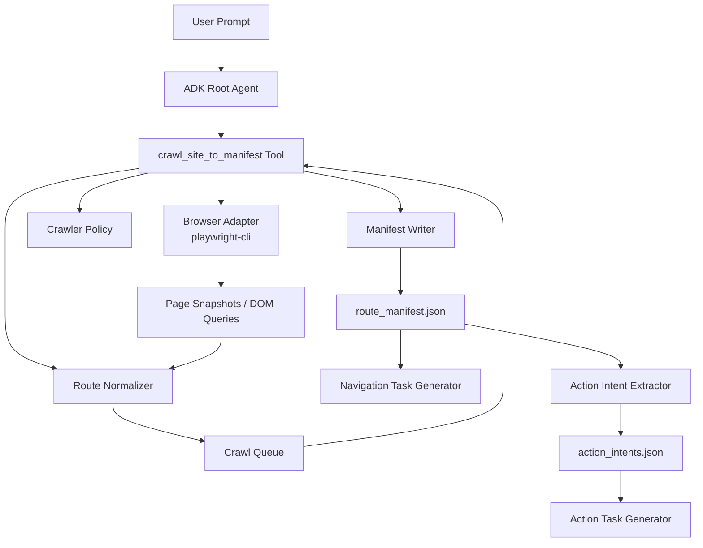

# Multi-Step Web Crawler Plan

This document defines the plan, architecture, and workflow for evolving the ADK Playwright agent from a shallow home-page link collector into a multi-step crawler that can explore a web application through real browser navigation, generate route-level navigation tasks, and generate page-action workflow tasks.

## Objective

The crawler must not only inspect links visible on the home page. It must be able to:

- start from a configured entry URL
- click through discovered same-origin routes
- continue exploration across multiple depths
- record how each page was reached
- distinguish guest, signed-in, and admin areas
- identify overlay workflows that do not create a new URL
- produce a route manifest that can drive task/test generation
- inspect discovered routes for workflow intents such as create/edit/search
- generate action tasks such as `Create Employee` when a matching page is found

The execution target is route-first generation:

1. Crawl and produce a stable route manifest.
2. Generate navigation tasks from the route manifest.
3. Revisit routes and produce an action intent catalog.
4. Generate action tasks from the action intent catalog.

## Skillized Operator Entry

To avoid repeatedly sending long operator prompts, expose the full sequence as a Skill.

Recommended skill package:

```text
skills/
  manifest_first_route_workflow/
    SKILL.md
    references/
      PARAMETERS.md
      VALIDATION_CHECKS.md
    assets/
      prompt_examples.md
```

Suggested skill contract:

- input: `start_url`, `site_name`, crawl depth/page limits, credential pointers
- behavior: run guest crawl -> guest generation -> auth crawl -> auth generation -> validation
- output: guest/auth manifest paths, generated counts, skipped counts, validation issues

Concise operator prompt (skill-oriented):

```text
Run the manifest-first-route-workflow skill for <start_url>.
Use site_name <sut_name>, generate guest/auth route navigation tasks, and report validation summary.
```

Example fixture prompts may use local SUTs such as Timeoff or NodeBB, but the
skill contract must stay SUT-neutral.

## Non-Goals for the First Version

The first version should avoid:

- destructive UI actions
- form submission except login
- creating data unless explicitly requested
- crawling external domains
- unlimited crawling
- automatic task/test generation during crawl

## High-Level Architecture



## Main Components

### 1. ADK Root Agent

Responsibilities:

- understand the target URL and output path
- choose crawl mode
- call a high-level crawl tool instead of manually chaining low-level tools
- summarize generated coverage

The root agent should not personally decide every click when a deterministic crawler tool can do it.

### 2. `crawl_site_to_manifest` and `crawl_authenticated_site_to_manifest`

These are the main high-level crawl tools. The guest tool handles public routes.
The authenticated tool performs login or reuses storage state, then applies the
same bounded same-origin crawl policy.

Inputs:

- `start_url`
- `output_path`
- `session_name`
- `max_depth`
- `max_pages`
- `include_patterns`
- `exclude_patterns`
- `crawl_authenticated`
- `phase`
- `sut_profile`
- `credentials_system_name`
- `storage_state_path`

Use `include_patterns` / `exclude_patterns` to split member/admin coverage.
Do not introduce a SUT-specific `crawl_admin` boolean unless a future tool schema
explicitly implements it.

Outputs:

- `manifest_path`
- `route_count`
- `skipped_count`
- `visited_count`
- `routes`
- `skipped_routes`
- `errors`

### 3. Browser Adapter

Uses `playwright-cli` to perform real browser actions:

- `open`
- `goto`
- `snapshot`
- `click`
- `eval`
- `fill`
- `state-save`
- `close`

The crawler may use direct `goto` for verification, but the manifest must preserve a navigation path that starts from the configured entry URL.

### 4. Crawler Policy

Determines which links and actions are safe to crawl.

Default exclusions:

- external domains
- `#` fragments
- `javascript:` links
- mail links
- file downloads
- RSS feeds
- `logout`
- `delete`
- `remove`
- `disable`
- `purge`
- `reset`
- `restart`
- undefined or malformed paths

### 5. Route Normalizer

Converts raw links into stable route records.

Examples:

- `http://localhost:3101/projects` -> `/projects`
- `/projects/42/` -> `/projects/42`
- `/reports?sort=newest&utm_source=test` -> canonical path plus non-tracking query metadata if needed

### 6. Manifest Writer

Writes a JSON manifest that becomes the single source of truth for later task/test generation.

### 7. Action Intent Extractor

Inspects each accepted route and collects workflow intents.

Examples:

- `create employee` on `/users/add`
- `edit employee` on `/users/edit/:id`
- `search employees` on `/users`

The extractor should return structured intent metadata, not only free-form text.

### 8. Action Task Generator

Converts action intents into workflow test tasks.

Examples:

- `Navigate to Employees` (route-level)
- `Create Employee` (action-level)
- `Edit Employee` (action-level)

## Context and Memory Architecture

The crawler should not rely on raw conversation history as its source of truth. Web exploration produces noisy snapshots, repeated tool output, and failed clicks, so context must be split into three layers.

### 1. Working Memory

Working memory is short-lived and LLM-visible.

It should contain only:

- compact current page summary
- current URL and title
- visible headings
- primary safe actions
- sampled same-origin links
- visible form/input summary
- snapshot artifact path
- feedback from the most recent 3 operations

It should not contain:

- raw full DOM
- full snapshot text
- credentials
- entire crawl history

Raw DOM or large snapshots should be written to artifacts or files and referenced by path.

### 2. Task State

Task state is deterministic crawler state.

It should contain:

- crawl phase
- start URL
- visited paths
- pending queue
- discovered route metadata
- route parent chain
- retry counters
- skipped routes
- structured errors

This layer should be maintained by crawler code, not inferred from an LLM summary. If the ADK event history is compacted, task state must still be sufficient to continue the crawl.

### 3. Long-Term Memory

Long-term memory stores stable facts that survive across runs or sessions.

It should contain:

- final user goal
- target app name
- confirmed username
- credentials file path
- storage state path
- known safe exclusions
- avoided error paths and blocked actions

It must not store raw passwords. Passwords should only be loaded inside the login tool when needed.

### Context Pack

Every crawl step should build a compact context pack for the agent:

```json
{
  "goal": "Explore the target SUT and write a route manifest",
  "working_memory": {
    "current_page": {
      "url": "http://localhost:3101/projects",
      "title": "Projects | Example SUT",
      "headings": ["Projects"],
      "primary_actions": ["Login", "Register", "Search"],
      "links_sample": [
        {"text": "Project Alpha", "path": "/projects/42"}
      ],
      "snapshot_artifact": ".adk/snapshots/projects.json"
    },
    "recent_feedback": []
  },
  "task_state": {
    "phase": "guest",
    "visited_count": 12,
    "pending_count": 23,
    "next_candidates": ["/projects/42", "/reports"]
  },
  "long_term_memory": {
    "credentials": {
      "example_sut": {
        "username": "demo@example.test",
        "credentials_source": "D:/Ker/Desktop/Document/other/GUI_test/passwords.txt"
      }
    },
    "blocked_actions": []
  }
}
```

### Token Cleanup and Compaction

Use deterministic compaction before relying on ADK-level event compaction:

1. Estimate context pack size.
2. If the pack exceeds 70% of the configured token budget, compact it.
3. Keep the current page summary, recent 3 operation results, counts, and next candidates.
4. Replace long lists with counts plus samples.
5. Keep raw snapshots on disk and reference them by path.

ADK context compaction can still be enabled as a second safety layer for long event histories, but crawler state should remain file/state backed and recoverable without the raw conversation.

### Error Attempt Memory

Every failed or blocked action should produce a structured error attempt record:

```json
{
  "url": "/category/2/general-discussion",
  "action": "click",
  "target": "text=Delete",
  "error_type": "blocked_by_policy",
  "attempt_count": 2,
  "blocked": true
}
```

Loop prevention rules:

- block the same `(url, action, target)` after repeated failures
- mark no-op clicks when URL and page summary do not change
- skip routes that repeatedly timeout
- write skipped routes and blocked actions into the manifest
- never let one bad route stop the entire crawl unless it is the entry point

## Crawl Strategy

Use bounded BFS as the default.

Why BFS:

- produces predictable route ordering
- explores main navigation before deep content
- easier to cap by depth and page count

DFS can be added later for deeper workflow exploration.

## Crawl Phases

### Phase 1. Guest Crawl

Start from the home page without login.

Steps:

1. Open browser with `--headed --persistent`.
2. Navigate to `start_url`.
3. Collect same-origin links.
4. Normalize candidate routes.
5. Add safe unvisited routes to the queue.
6. Visit each route up to `max_depth` and `max_pages`.
7. Record page metadata and outgoing links.

Expected output:

- public navigation routes
- category/list pages
- topic/content pages
- public login/register pages

### Phase 2. Authenticated Crawl

Login if credentials are available and the user requested deeper coverage.

Authenticated coverage should be written to a separate manifest first, for example:

- `manifests/<sut>/route_manifest.guest.json`
- `manifests/<sut>/route_manifest.auth.json`

Do not overwrite the guest manifest until the diff between guest and authenticated coverage is understood.

Steps:

1. Navigate to login route.
2. Fill credentials from configured notes file.
3. Submit login.
4. Save storage state.
5. Restart or continue crawl as signed-in user.
6. Record member-only routes.

Expected output:

- account/profile pages
- user or tenant settings pages
- notifications or inbox pages when present
- role-specific pages visible from signed-in navigation
- workflow entry pages that are safe to inspect without submitting forms

### Phase 3. Admin Crawl

Only run when the user requests admin coverage or the site clearly exposes admin navigation for the logged-in user.

Steps:

1. Visit admin landing page from signed-in navigation.
2. Collect admin navigation links.
3. Crawl safe admin pages.
4. Do not click destructive buttons or submit settings forms.

Expected output:

- dashboard pages
- management pages
- settings pages
- diagnostics pages
- product-specific admin pages visible from navigation

### Phase 4. Overlay Workflow Detection

Some workflows do not create a new URL.

Examples:

- create/edit dialogs
- modal dialogs
- side drawers
- dropdown menus

Strategy:

1. Detect safe action buttons such as `New`, `Create`, or `Edit`.
2. Click the action only if policy allows it.
3. Capture UI evidence after click.
4. Record an overlay workflow route with `validation_mode: "ui_evidence"`.
5. Do not submit the form.

### Phase 5. Route-to-Action Intent Scan

After route crawling is stable, inspect each accepted route for workflow intents.

Steps:

1. Open each route in deterministic order.
2. Collect form fields, submit controls, and workflow labels.
3. Classify intents (`create`, `edit`, `search`, `filter`, `approve`, etc.).
4. Record intent evidence, required inputs, and safety level.
5. Write `action_intents.json`.

Expected output:

- route-to-intent mapping
- reusable action catalog for task generation

### Phase 6. Action Task Generation

Convert action intents into workflow tasks.

Steps:

1. Read `action_intents.json`.
2. Generate one action task per accepted intent.
3. Include form steps and expected outcomes.
4. Preserve login metadata and route provenance.
5. Validate output structure.

Expected output:

- `task_*.json` entries for workflow actions
- examples: `Create Employee`, `Edit Employee`, `Search Employees`

## Manifest Schema

Suggested top-level shape:

```json
{
  "schema_version": "1.0",
  "generated_at": "2026-04-16T00:00:00Z",
  "start_url": "http://localhost:3101/",
  "base_origin": "http://localhost:3101",
  "crawl_options": {
    "max_depth": 3,
    "max_pages": 100,
    "crawl_authenticated": true,
    "phase": "auth",
    "sut_profile": "generic",
    "include_patterns": [],
    "exclude_patterns": []
  },
  "summary": {
    "route_count": 74,
    "skipped_count": 12,
    "error_count": 0
  },
  "routes": [],
  "skipped_routes": [],
  "errors": []
}
```

## Route Record Schema

Each route should be represented as:

```json
{
  "id": "example_sut_guest_detail_projects_42",
  "label": "Project Alpha",
  "url": "http://localhost:3101/projects/42",
  "path": "/projects/42",
  "query": "",
  "page_title": "Project Alpha | Example SUT",
  "page_type": "detail",
  "phase": "guest",
  "require_login": false,
  "depth": 1,
  "source_path": "/",
  "navigation_steps": [
    "I open the configured home page",
    "I click the \"Project Alpha\" link from the home page"
  ],
  "assertions": [
    "The browser URL should include \"/projects/42\"",
    "The page title or primary heading should show \"Project Alpha\""
  ],
  "validation_mode": "url",
  "discovered_links": [
    "/projects/42/activity"
  ]
}
```

## Overlay Workflow Record Schema

Overlay workflows should use the same manifest but a different validation mode:

```json
{
  "id": "example_sut_authenticated_create_project",
  "label": "Create Project",
  "url": "http://localhost:3101/projects",
  "path": "/projects",
  "page_type": "overlay",
  "phase": "authenticated",
  "require_login": true,
  "depth": 2,
  "source_path": "/projects",
  "navigation_steps": [
    "I open the configured home page",
    "I click the \"Projects\" navigation item",
    "I click the \"New Project\" button"
  ],
  "assertions": [
    "The project name field should be visible",
    "The cancel button should be visible",
    "The submit button should be visible but not clicked"
  ],
  "validation_mode": "ui_evidence",
  "ui_evidence": {
    "visible_text": ["Create", "Cancel"],
    "inputs": ["Project name"]
  }
}
```

## Action Intent Record Schema

Action intents should be stored as structured records:

```json
{
  "intent_id": "timeoff_create_employee_users_add",
  "route_id": "timeoff_authenticated_account_users_add",
  "intent_type": "create",
  "entity": "employee",
  "entry_path": "/users/add",
  "phase": "authenticated",
  "require_login": true,
  "fields": ["firstname", "lastname", "email"],
  "submit_label": "Create",
  "success_assertions": [
    "The employee list should include the new employee",
    "A success message should be visible"
  ],
  "safety_level": "safe_with_confirmation"
}
```

## Page Type Classification

Use heuristics based on URL, title, headings, and visible forms.

Suggested page types:

- `home`
- `auth`
- `account`
- `settings`
- `search`
- `dashboard`
- `section`
- `detail`
- `create`
- `edit`
- `admin`
- `admin_settings`
- `admin_manage`
- `page`
- `overlay`

SUT-specific page types may be added through an explicit profile, but the default crawler behavior should stay generic and URL/DOM driven.

## Navigation Path Rules

Every route must preserve how it can be reached from the entry point.

For a direct home link:

```json
[
  "I open the configured home page",
  "I click the \"Users\" link in the top navigation"
]
```

For a nested route:

```json
[
  "I open the configured home page",
  "I click the \"Projects\" link in the top navigation",
  "I click the \"Project Alpha\" link"
]
```

If the crawler uses direct `goto` internally for efficiency, it must still derive and store a real clickable path when possible.

## Safety Rules

Default safe actions:

- clicking links
- opening menus
- opening non-submitting overlays
- filling login forms
- saving storage state
- reading page DOM

Default unsafe actions:

- submit buttons outside login
- delete/remove/disable actions
- restart/rebuild actions
- admin settings save buttons
- file uploads
- payments or checkout flows

Unsafe actions require explicit user permission.

## Crawl Limits

Recommended defaults:

- `max_depth`: 3
- `max_pages`: 100
- `max_links_per_page`: 80
- `same_origin_only`: true
- `query_policy`: strip tracking queries by default

The crawler should stop when:

- max depth is reached
- max pages is reached
- queue is empty
- login fails
- too many repeated errors occur

## Error Handling

Errors should not crash the entire crawl unless they block the entry point.

Error categories:

- `navigation_failed`
- `locator_not_found`
- `login_failed`
- `permission_denied`
- `timeout`
- `unexpected_dialog`
- `unsafe_action_skipped`

Errors should be written into the manifest.

## Validation Strategy

After writing the manifest:

1. Validate JSON shape.
2. Validate route IDs are unique.
3. Validate every route has `navigation_steps`.
4. Validate every route has assertions.
5. Optionally revisit a sample of routes to confirm URLs or UI evidence.

## Implementation Milestones

### Milestone 1. Guest BFS Manifest

Deliverables:

- `crawl_site_to_manifest`
- `CrawlerContext`
- deterministic context pack compaction
- error attempt memory and loop guard
- guest-only BFS
- route normalization
- manifest writer

Acceptance:

- can crawl `http://localhost:3101`
- writes a route manifest under the configured output directory
- discovers more than home-page-only links
- no task files generated

### Milestone 2. Authenticated Crawl

Deliverables:

- login phase
- storage state save
- signed-in navigation discovery

Acceptance:

- member-only routes appear in manifest
- credentials are not written into manifest
- guest and authenticated manifests can be compared before task generation

### Milestone 3. Admin Crawl

Deliverables:

- admin navigation discovery
- admin-safe policy

Acceptance:

- admin pages appear in manifest
- no destructive buttons are clicked

### Milestone 4. Overlay Workflows

Deliverables:

- safe action detection
- UI evidence recording

Acceptance:

- composer/modal workflows can be represented without requiring a unique URL

### Milestone 5. Manifest-to-Navigation-Task Generation

Deliverables:

- task generator consumes manifest
- one navigation task per accepted route

Acceptance:

- generated tasks preserve navigation path from home
- task validation passes

### Milestone 6. Route-to-Action Intent Extraction

Deliverables:

- route action scan pass
- action intent catalog (`action_intents.json`)

Acceptance:

- create/edit/search intents are extracted where present
- each intent has route provenance and evidence

### Milestone 7. Action Task Generation

Deliverables:

- action task generator consumes action intent catalog
- one workflow task per accepted action intent

Acceptance:

- `Create Employee` style tasks are generated when matching forms exist
- action task validation passes

### Milestone 8. Skillized Manifest-First Workflow

Deliverables:

- ADK skill package for the long manifest-first route workflow
- concise invocation pattern and parameter reference docs

Acceptance:

- operators can trigger the whole sequence without enumerating all steps
- output parity is maintained versus manual multi-step execution

## Open Questions

- Should query-string variants be considered separate routes?
- Should user profile pages discovered from content be included by default?
- Should admin diagnostics pages be included in the first admin crawl?
- How much UI evidence should be stored for overlays?
- Should the crawler prefer real click replay over direct `goto` for every route, even if slower?

## Recommended Next Step

If route crawl and navigation task generation are already stable, implement Milestone 6 next:

> Route-to-action intent extraction with bounded per-route action scan.

After Milestone 6 is stable, implement Milestone 7 for workflow task generation.

After Milestone 7 is stable, package Milestone 1-7 as a reusable skill entrypoint.
