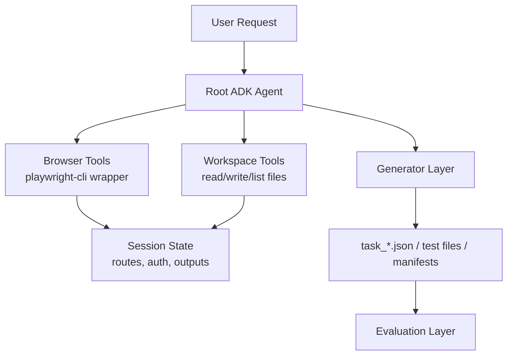

# ADK Playwright Test Agent Design

As of 2026-04-17, this document set describes the design and current implementation direction for building an agent with Google Agent Development Kit (ADK) that can:

- use `playwright-cli` to explore a web application
- infer navigable pages and important workflows
- generate route-level navigation tasks first, then page-action tasks
- optionally save authenticated browser state for reuse

This package now lives inside the `adk_playwright_agent` implementation repo.
Some pieces are implemented already, while the action-intent and ADK Skill
packaging layers remain planned work.

Current implementation status:

- implemented: headed persistent `playwright-cli` adapter, guest/auth crawlers, manifest writer, context memory helpers, navigation task generator, validation helpers, manifest-first workflow tool, static action intent extractor, minimal ADK Skill package
- planned: action workflow task generation, expanded ADK Skill resources and scripts, optional bounded browser-backed intent verification
- intentionally generic: SUT-specific behavior belongs in manifests, generated tasks, or optional profiles, not in crawler defaults

## Goal

Build an ADK-based agent that behaves like a lightweight browser QA assistant:

- start from a target URL
- inspect the current project for existing conventions
- open a browser session with `--headed` and `--persistent`
- explore guest, signed-in, and admin routes
- write structured outputs such as route manifests, navigation tasks, and action tasks
- optionally validate generated outputs against simple coverage and navigation rules

The target output strategy is two-stage:

1. Generate route coverage tasks (for example, `Navigate to Employees`) from discovered routes.
2. Revisit discovered routes, infer page-level actions (for example, `Create Employee`), and generate workflow tasks.

## Recommended Stack

- Language: Python
- Agent framework: Google ADK
- Browser backend: `playwright-cli`
- Output format, first milestone: JSON task files
- Optional second output format: Playwright test code

## Skill-Packaged Long Workflows

For long, repeatable operations such as manifest-first route generation, package the
workflow as an ADK Skill instead of relying on a long ad-hoc prompt each time.

Why this matters:

- consistency: one approved sequence of crawl -> generate -> validate
- shorter prompts: users trigger one skill-oriented request instead of 7+ manual steps
- safer evolution: update one skill file when defaults or policies change
- context efficiency: load detailed instructions and resources only when the skill is used

ADK Skills notes:

- supported in ADK Python v1.25.0+ and still experimental
- load file-based skills with `load_skill_from_dir(...)`
- import the module as `from google.adk.tools import skill_toolset`
- create toolsets with `skill_toolset.SkillToolset(...)`
- define skills in files (`SKILL.md`, optional `references/`, `assets/`, `scripts/`) or in code
- version-gate usage in this project because the API is experimental

Recommended skill for this project:

- `manifest-first-route-workflow`: executes guest crawl, auth crawl, task generation, and directory validation in one guided run

## Why ADK Fits This Problem

ADK is a good fit because it already supports the major building blocks this agent needs:

- custom function tools for wrapping `playwright-cli`
- session state for tracking discovered routes and login state
- custom agents or workflows for multi-step orchestration
- human confirmation for risky actions
- evaluation features for measuring route coverage and task quality

## Recommended Architecture

The simplest reliable design is:

1. A root ADK agent handles planning and orchestration.
2. A browser tool layer wraps `playwright-cli` as structured tools.
3. A workspace tool layer reads and writes local project files.
4. A generator layer converts exploration results into task or test artifacts.
5. An evaluation layer checks route coverage and output quality.

## Preferred Execution Model

The preferred execution model is ADK plus custom function tools.

Why:

- fastest path to MVP
- least architectural overhead
- easiest debugging
- easiest to constrain permissions

An MCP version is still viable, but it should be treated as a second-phase refactor after the tool boundaries are proven.

## Key Design Decisions

### 1. Do not expose a raw shell by default

The agent should not receive unrestricted shell access as its primary interface. Instead, it should get a narrow browser tool interface such as `open_browser`, `snapshot`, `click`, and `fill`.

This improves:

- safety
- observability
- reproducibility
- prompt reliability

### 2. Use ADK state only for serializable data

State should store simple serializable values such as:

- session names
- current URL
- discovered routes
- auth state paths
- output directories

Do not store live subprocess handles or browser objects inside ADK state.

### 3. Evaluate overlays and modal workflows by UI evidence, not URL only

Some workflows do not result in a distinct URL. A composer, drawer, or modal may stay on the same route. For these cases, evaluation should verify visible UI elements instead of assuming a URL transition.

### 4. Start with one site and one session

The first implementation should target one site at a time and one browser session at a time. Multi-site and multi-session orchestration should be added later.

## Scope Recommendation

### MVP

- single website
- one `playwright-cli` session
- guest route discovery
- optional login flow from credentials file
- signed-in route discovery
- route manifest generation
- navigation task generation from accepted routes
- basic page-action intent detection metadata
- basic validation of generated tasks

### Later

- action-task generation (for create/edit/search/filter workflows)
- skillized workflow presets for common operator tasks
- direct Playwright test generation
- auto-repair of selectors
- multiple output styles per project
- MCP server wrapper
- multi-agent specialization

## Deliverables in This Design Package

- [Tool and State Design](./TOOLS_AND_STATE.md)
- [Implementation Plan](./IMPLEMENTATION_PLAN.md)
- [Multi-Step Web Crawler Plan](./MULTI_STEP_CRAWLER_PLAN.md)

## Official ADK References

These design notes are based on the official ADK documentation current as of 2026-04-17.
Use `https://adk.dev` as the source of truth before changing ADK APIs.

Version policy:

- stable project line: `google-adk>=1.31.0,<2.0`
- ADK 2.0 is Alpha / pre-GA and should be tested in a separate migration branch
- do not mix ADK 1.x and 2.0 persistent storage for sessions, memory, or eval data

References:

- ADK home: <https://adk.dev/>
- Python quickstart: <https://adk.dev/get-started/python/>
- Skills for ADK agents: <https://adk.dev/skills/>
- Context compaction: <https://adk.dev/context/compaction/>
- State: <https://adk.dev/sessions/state/>
- Tool limitations: <https://adk.dev/tools/limitations/>
- ADK 2.0 overview: <https://adk.dev/2.0/>
